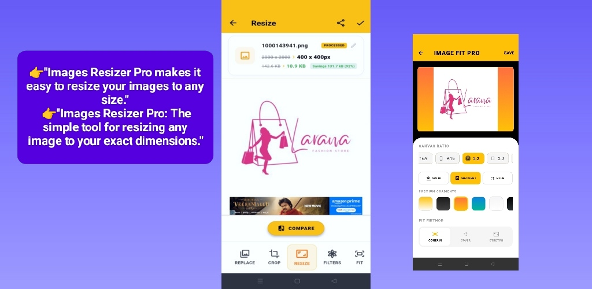
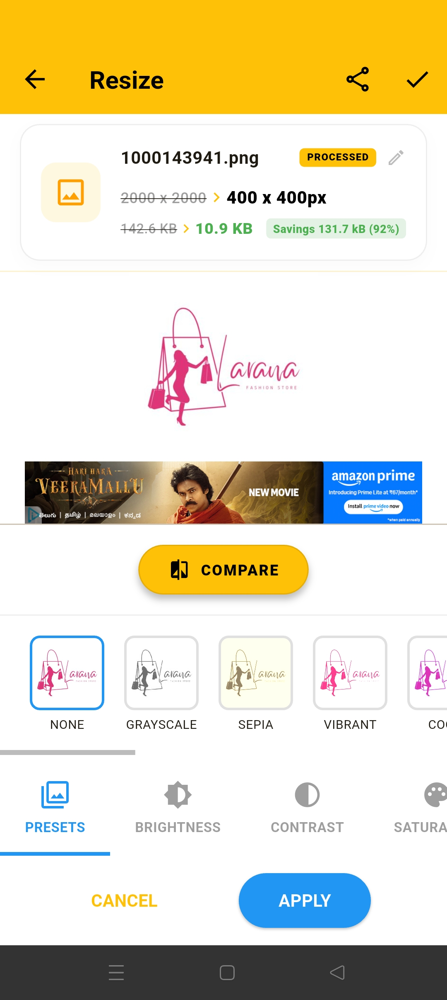
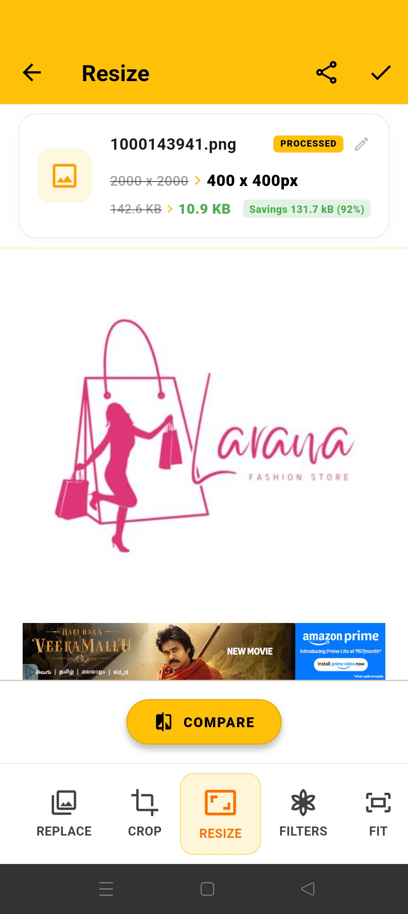
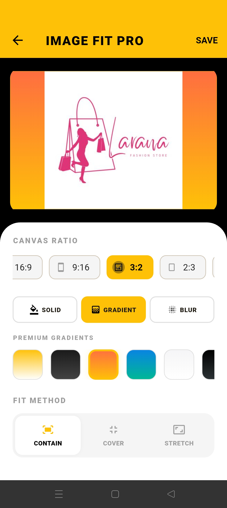
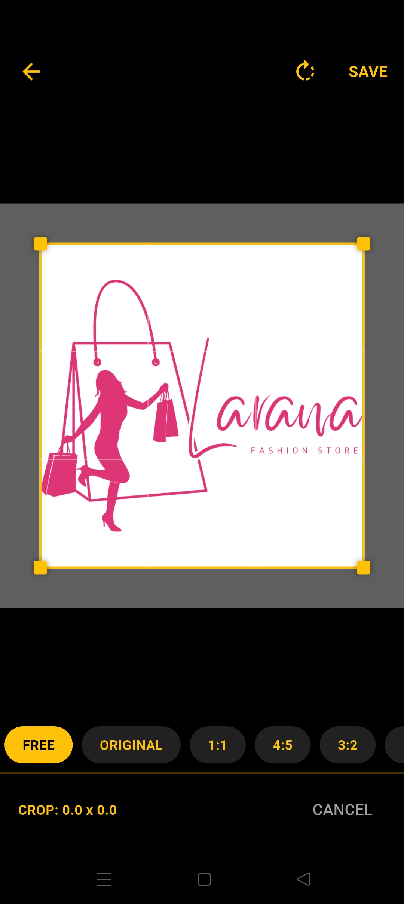
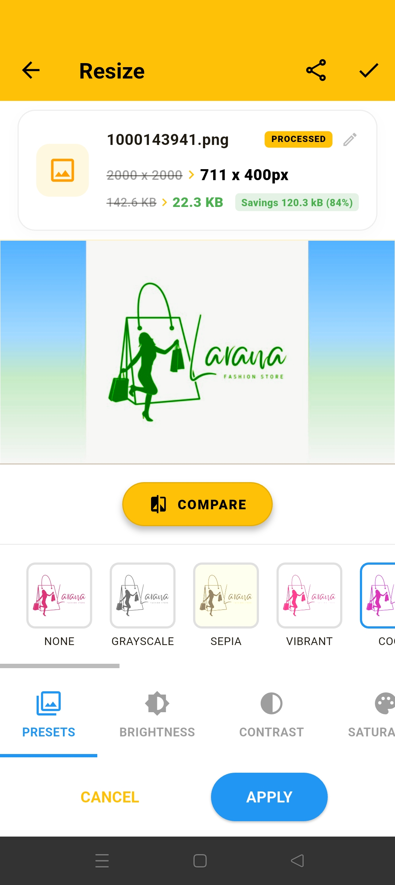
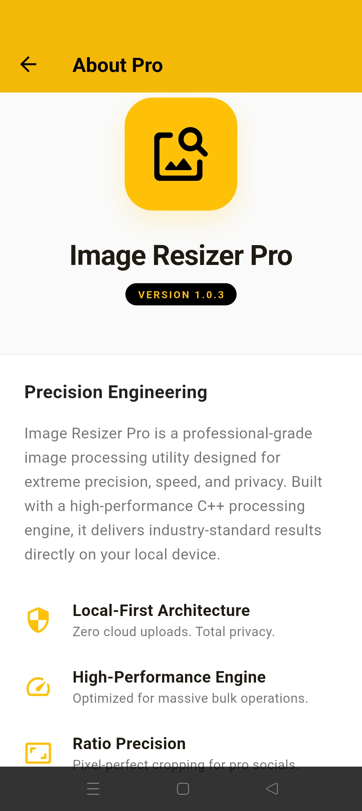
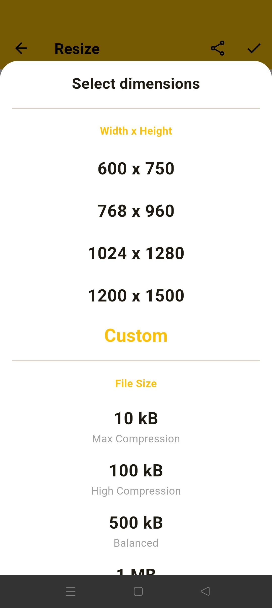
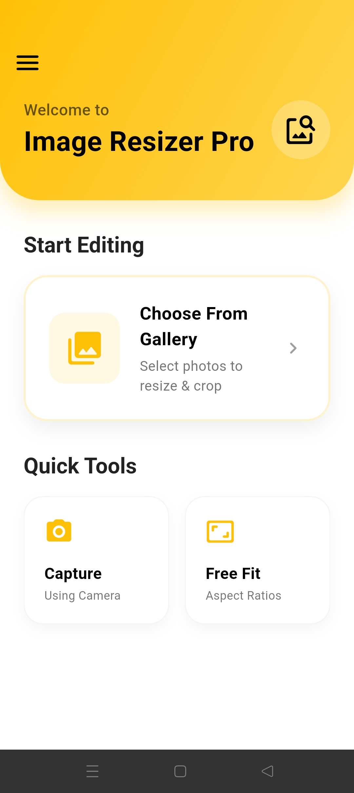

# Image Resizer Pro

A premium, industrial-grade image resizing and processing utility built with Flutter and C++.



## 🛡️ Security & Privacy (Local-First)

**Image Resizer Pro** is designed with a "Local-First" architecture:
- **100% On-Device**: All image processing happens locally. No images are ever uploaded to any server.
- **Zero Tracking**: We do not collect any personal data or usage analytics.
For support or feedback, please contact: **jasu1070@gmail.com**
- **Privacy by Design**: Your data remains yours, always.

For more details, see our [Security Policy](SECURITY.md) and our in-app [Privacy Policy](lib/screens/privacy_policy_screen.dart).

## Getting Started

This project uses a high-performance C++ engine for image processing to ensure speed and precision.

# Image Resizer Pro: Cloud Config Repository

This repository hosts the official update configurations for the **Image Resizer Pro** application by **TECHNOLOGY DEVELOPMENTS**.

> [!NOTE]
> This is a configuration-only repository. The application source code is private and protected for security reasons.

## ✨ Key Features & Precision Tools

Experience the ultimate in image processing with our fine-tuned industrial toolset.

| **Precision Fit** | **Industrial Scale** | **Creative Gradients** | **High-Fidelity Filters** |
|:---:|:---:|:---:|:---:|
|  |  |  |  |

| **Industrial Presets** | **Smart Comparison** | **C++ Core Engine** | **Smart Cropping** |
|:---:|:---:|:---:|:---:|
|  |  |  |  |

## 📂 Repository Structure

- `version.json`: The source of truth for the update system.
- `README.md`: Instructions and documentation.
- `assets/screens/`: App preview and mobile screenshots.

## 🚀 How to Update the App

1. **Edit `version.json`**: Update version codes and links.
2. **Commit Changes**: Push to GitHub to trigger updates for all users.

## 📝 Configuration Schema

```json
{
  "versionCode": 2005,
  "versionName": "1.0.4",
  "minVersionCode": 2000,
  "apkUrl": "https://www.uptodown.com/android/imageresizer",
  "releaseNotes": "• Critical security hardening\n• New high-fidelity UI gradients\n• Performance optimizations",
  "isStoreRedirect": true
}
```

